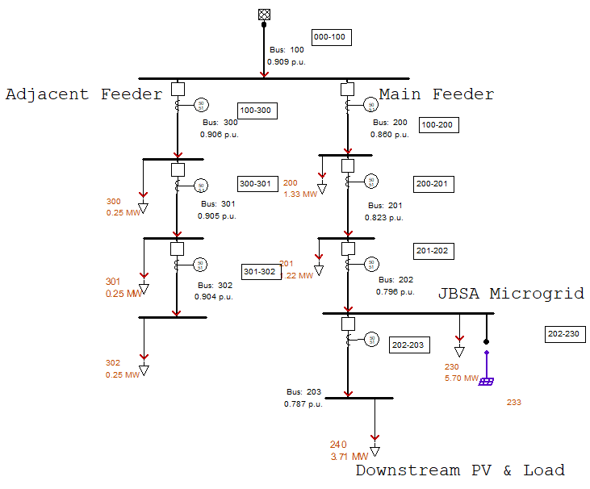
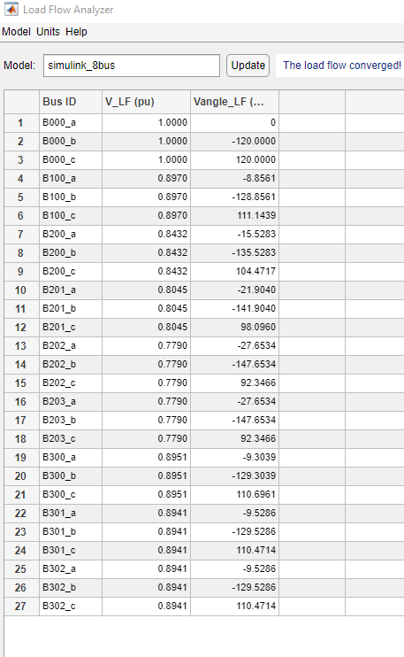

# simulink-8bus
Simulink SPS 8bus network

Line IDs: [000-100 100-200 200-201 201-202 202-203 100-300 300-301 301-302].

Line lengths: [1500 1000 1000 1000 1000 1500 1500 1500] (ft).

The simulink lines are using the pi model which requires positive/negative sequence impedance.
In cyme, the lines are defined by Z matrix impedance.

Load values and lengths are matching cyme 8-bus network v17.

